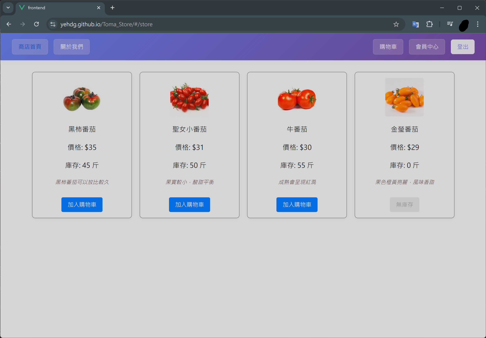
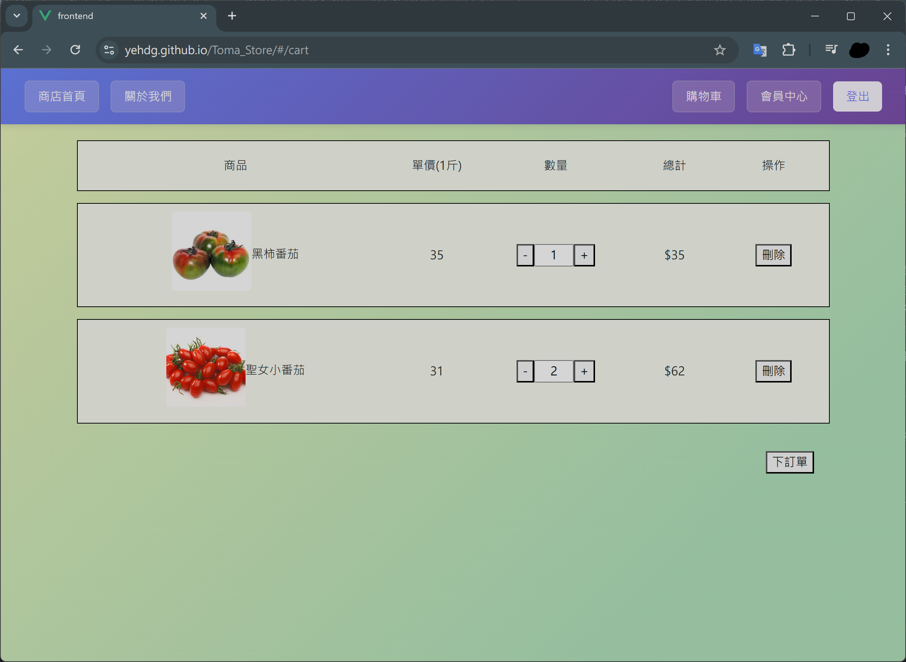
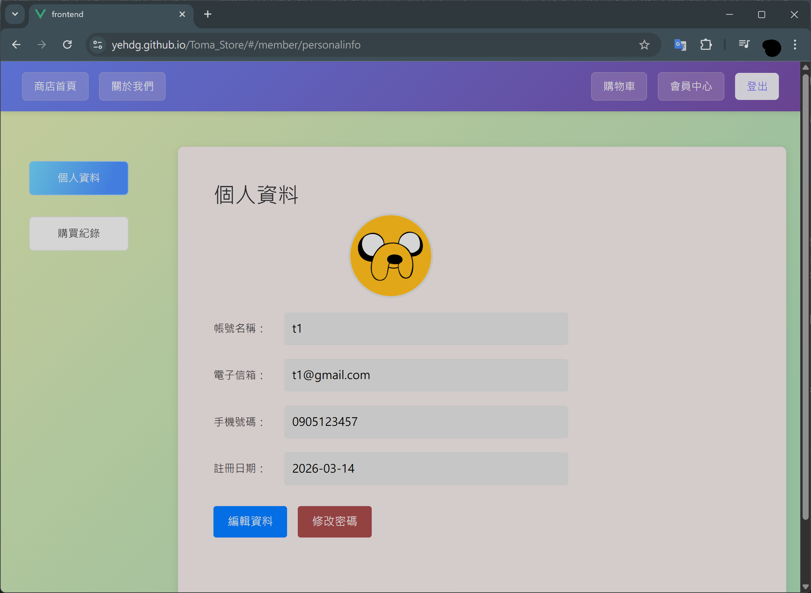
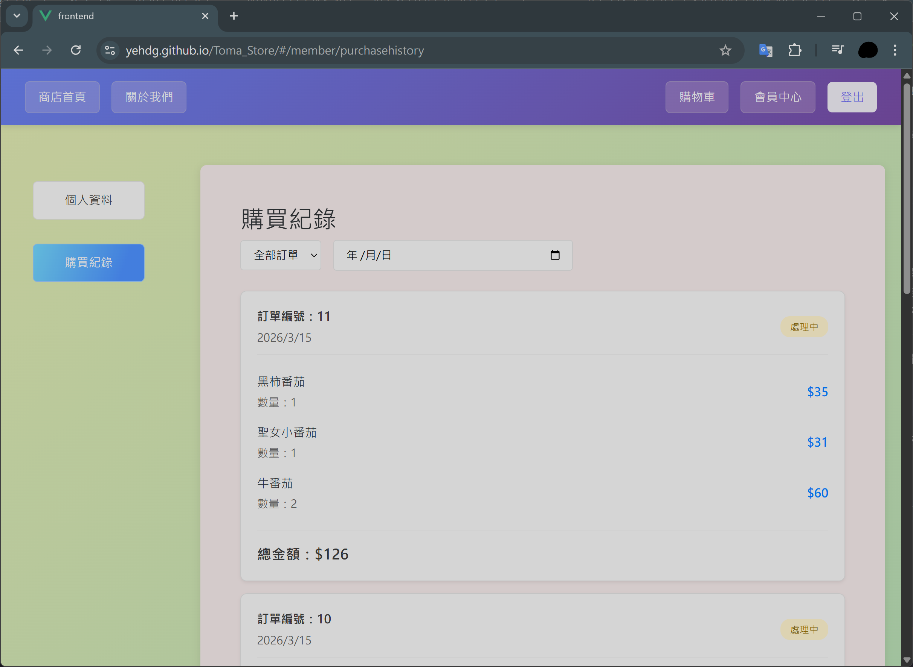

# 電商網站 (Toma Store)

##  專案簡介
這是一個全端 Web 應用程式，採用MVC架構，提供完整的線上購物平台。用戶可以瀏覽商品、加入購物車並進行下訂單，會員系統支援註冊登入、個人資料管理、頭貼上傳，以及購買歷史紀錄的查詢功能。

**部署架構:**
- **前端**: GitHub Pages 
- **後端**: Railway 
- **資料庫**: Railway (MySQL) 

🌐 **Demo 展示**：[Toma Store 電商平台](https://yehdg.github.io/Toma_Store/)  

(不想註冊)想直接登入的話：  
◇信箱：test@gmail.com   
◇密碼：1234  

##  專案技術
**前端：**
- Vue 2
- Vue Router
- Axios

**後端：**
- Node.js
- Express.js
- Prisma ORM
- MySQL2
- dotenv
- cors

**會員系統:**
- JWT (JSON Web Token)
- bcryptjs
- cookie-parser
- Joi

**檔案處理:**
- Multer

**資料庫：**
- MySQL

##  功能
- 🍅 商品瀏覽
- 🛒 購物車管理
- 👤 會員註冊/登入
- 📸 頭貼上傳
- 🔒 密碼修改
- 📋 購買紀錄

## 專案設計
###  架構設計
- **MVC 分層架構**：前後端分離設計
- **RESTful API**：標準化的 API 設計模式
- **模組化開發**：Controllers、Models、Routes 分離

###  安全機制
- **密碼加密**：使用 bcryptjs 雜湊加密
- **身份驗證**：JWT + HttpOnly Cookie 無狀態驗證
- **輸入驗證**：Joi 數據驗證
- **CORS 跨域防護**：安全的跨域資源共享

###  檔案處理
- **檔案上傳**：Multer 中間件處理頭貼上傳
- **靜態資源**：Express 靜態檔案服務
- **圖片管理**：自動檔案命名與路徑管理

###  用戶體驗
- **響應式設計**：支援各種裝置瀏覽
- **SPA 單頁應用**：Vue Router 頁面切換
- **異步數據請求**：使用 Axios 實現無刷新頁面更新
- **即時購物車**：動態商品管理

###  資料庫設計  
- **ORM 框架**：Prisma 型態安全的資料庫操作
- **關聯查詢**：會員、商品、訂單關聯設計

### 專案展示
#### ●首頁/商店頁面  

商品區，登入後，可以點選按鈕就會加入購物車。

#### ●購物車

購物車頁面會顯示有加入購物車的商品，會員可以選擇修改數量、刪除商品、下訂單所有商品。

#### ●會員功能

\[註冊/登入頁面\]註冊與登入的彈跳視窗，可以註冊帳號並登入。

 

\[會員區\]會員可以修改自己的名稱、手機號碼、頭貼、密碼。

 

\[購買紀錄\]會員可以查看過往的購買紀錄，可以依照狀態與時間來篩選。

